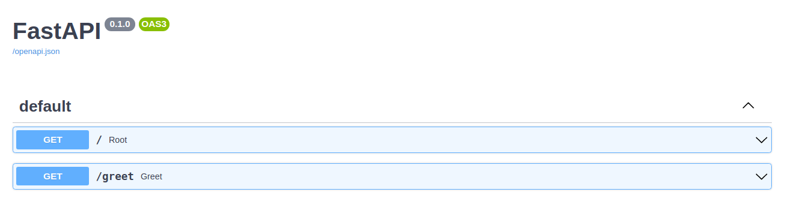
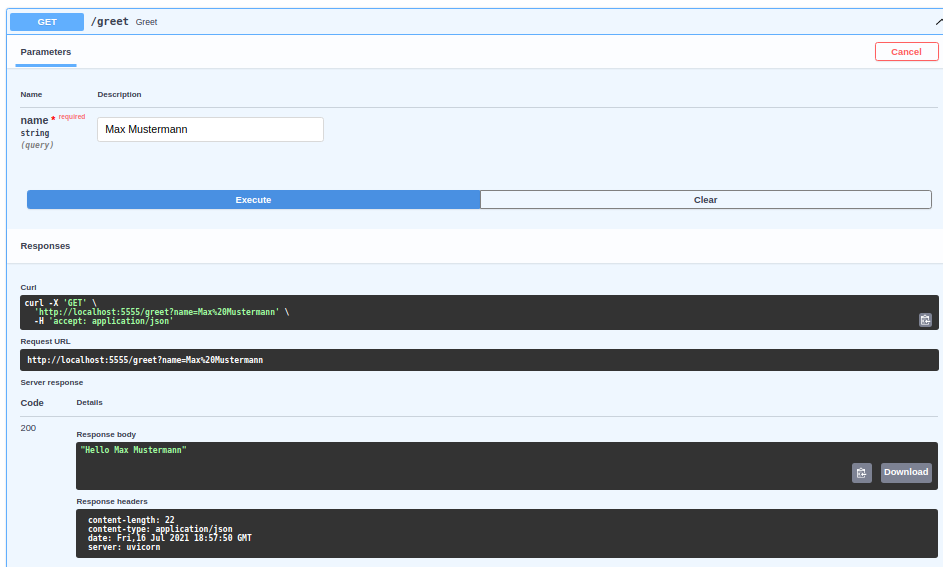

# FastAPI's Swagger Auto Docs

Um API Endpoints einfacher zu Testen kann man die Swagger Auto Docs verwenden.

Diese findet man auf http://localhost:5555/docs.

Man kann die einzelne Endpoints ausklappen und Requests mit Parametern senden.

Hiermit kann die Api einfach getestet werden.