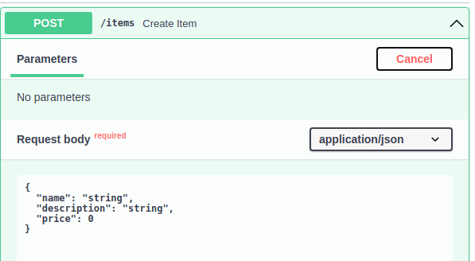

# Request Body mit Pydantic
## Pydantic Models

Mit Pydantic können Modelle von Datenstrukturen(in JSON) festgelegt werden die die API annimmt.

```py
from pydantic import BaseModel
from typing import Optional

class Item(BaseModel):
    name: str
    description: Optional[str]
    price: float
```
Jetz haben wir ein `Item` Model mit einer Struktur die z.B. folgende Daten annimmt:
```json
{
    "name": "Foo",
    "description": "A good Description",
    "price": 134.67
}
```
oder
```json
{
    "name": "Foo",
    "price": 134.67
}
```
da die Description Optional ist.

## Models in FastAPI Verwenden

```py
from fastapi import FastAPI
from pydantic import BaseModel
from typing import Optional

class Item(BaseModel):
    name: str
    description: Optional[str]
    price: float

app = FastAPI()

@app.post("/items")
async def create_item(item: Item):
    return f"Itemname: {item.name}, " \
           f"Itembeschreibung: {item.description or 'Nicht vorhanden'}, " \
           f"Preis: {item.price}"
```

In den Docs sollte das Model direkt dargestellt werden.


Wenn man ein Datenfeld weglässt oder falsch angibt bekommt man einen `HTTP 422 Status Code`: `Unprocessable Entity`

## Request Body und Parameter in einer Route verwenden

Man kann zusätzlich zum Request Body auch Parameter verwenden.
```py
from fastapi import FastAPI
from pydantic import BaseModel
from typing import Optional

class Item(BaseModel):
    name: str
    description: Optional[str]
    price: float

app = FastAPI()

@app.post("/items")
async def create_item(item_id: int, item: Item):
    return {"item_id": item_id, **item.dict()}
```
Die `/items/` Route erzeugt ein JSON Objekt das die `item_id` in das Item Objekt "rein merged".