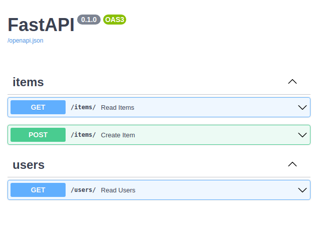

# Erweiterte Routen Optionen

## Status Codes

```py
@app.post("/aroute", status_code=201)
async def a_route():
    return "response"
```
bzw
```py
from fastapi import status

@app.post("/aroute", status_code=status.HTTP_201_CREATED)
async def a_route():
    return "response"
```

So können Status Code für Routen gesetzt werden.

## Route Tags

```py
from typing import Optional, Set

from fastapi import FastAPI

app = FastAPI()


@app.post("/items/", tags=["items"])
async def create_item():
    return "test"


@app.get("/items/", tags=["items"])
async def read_items():
    return "test"


@app.get("/users/", tags=["users"])
async def read_users():
    return "test"
```

Routen können Tags haben die in den Auto Docs angeziegt werden.


## Zusammenfassung und Beschreibung

```py
@app.post(
    "/items/",
    response_model=Item,
    summary="Create an item",
    description="A Description",
)
async def create_item(item: Item):
    return item
```


## Route Doc-Strings
```py
from typing import Optional

from fastapi import FastAPI
from pydantic import BaseModel

app = FastAPI()

class Item(BaseModel):
    name: str
    description: Optional[str] = None
    price: float

@app.post("/items/")
async def create_item(item: Item):
    """
    Creates an Item

    - **name**: each item must have a name
    - **description**: a long description
    - **price**: required
    """
    return item
```
Man kann mit dem Python Doc-String auch eine Beschreibung setzten.


## Response Description

```py
from typing import Optional

from fastapi import FastAPI
from pydantic import BaseModel

app = FastAPI()

class Item(BaseModel):
    name: str
    description: Optional[str] = None
    price: float

@app.post("/items/", response_description="The created item")
async def create_item(item: Item):
    return item
```


## Deprecated Route
```py
from typing import Optional

from fastapi import FastAPI
from pydantic import BaseModel

app = FastAPI()

class Item(BaseModel):
    name: str
    description: Optional[str] = None
    price: float

@app.post("/items/", deprecated=True)
async def create_item(item: Item):
    return item
```
